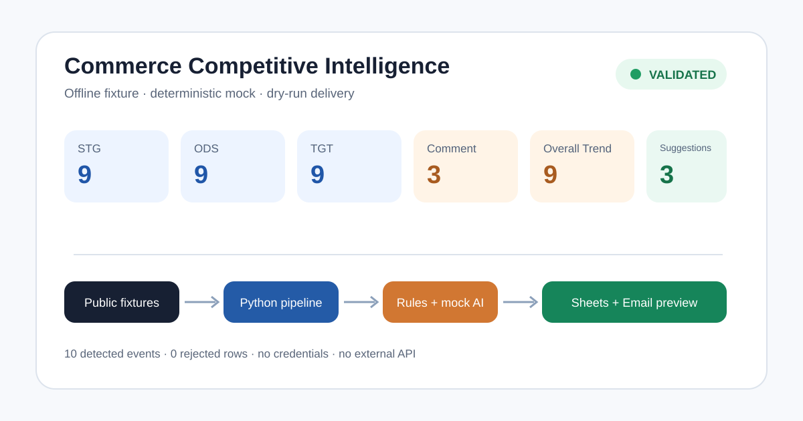
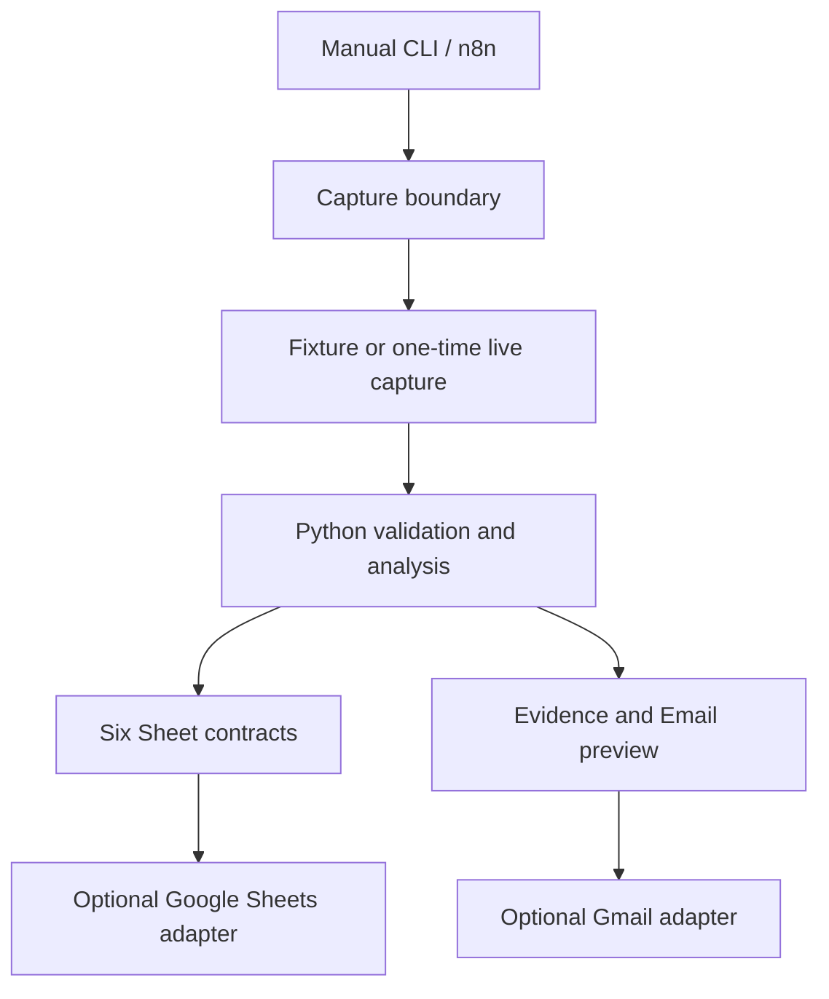
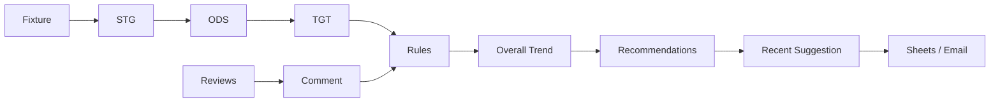

# Commerce Competitive Intelligence

[](https://github.com/3pwei/commerce-competitive-intelligence/actions/workflows/ci.yml)

## Overview

Commerce Competitive Intelligence 是可公開重現的電商競品情報 Demo。它用 Python 將三項示範商品在 Amazon、Walmart 與 Best Buy 的價格、庫存及評論轉成六張 Google Sheets 相容資料集，再由確定性規則辨識事件、由可替換的 LLM Adapter 產生有證據的營運建議。n8n 只負責人工觸發與選用的 Sheets／Email 交付。

預設路徑完全離線、零成本且不需要 credentials。Repository 內的商品頁、評論、價格與庫存均為 synthetic／sanitized 展示資料，不代表即時市場狀況。



## Business Problem

電商營運人員通常要跨站比價、追蹤缺貨、閱讀大量評論，再把判斷整理到試算表與 Email。這個專案示範如何把流程拆成可驗證、可追溯且供應商中立的資料管線：

- 同一批次統一追蹤競品價格、庫存與評論。
- 商業規則先判斷事實，LLM 只根據已確認事件提出建議。
- 六張 Sheet 在外部寫入前先做欄位順序與跨表關聯驗證。
- fixture、mock 與 dry-run 讓 Demo、測試及 CI 不依賴網站或付費服務。

## Features

- 三個 retailer 的可替換 `PageFetcher`／parser 邊界及 one-time capture。
- STG → ODS → TGT 的驗證、正規化、去重與 rejected-row audit。
- 評論的正規化、去重與結構化 mock／configured LLM 分析。
- 價格、庫存、評論風險事件與 evidence sidecars。
- 六張 Sheet contract、Google Sheets append、防重複 SEQN 與 Email preview。
- Manual Trigger-only n8n workflow；預設 fixture + mock + dry-run，並在畫布顯示 HTML parser、
  LLM review analysis、business rules 與 recommendation stage checkpoints。

## Architecture



完整架構、兩種擷取資料流及外部服務替換邊界見 [`docs/architecture.md`](docs/architecture.md)。

## Data Flow



Python 擁有擷取、解析、正規化、規則、LLM 輸出驗證及資料契約；n8n 只負責人工編排和外部交付。此專案**沒有排程、Database 或常駐 API**。

## Quick Start

### Windows Docker Desktop（建議）

需要 Docker Desktop 4.x（Linux containers + Docker Compose v2）。專案固定使用
`n8nio/n8n:2.4.4`，自訂 image 內含 Python 3.12 相容 runtime、專案套件與 fixture；不需要進入
容器安裝任何套件。全新 clone 後，在 Windows PowerShell 執行：

```powershell
docker compose build n8n
docker compose up -d n8n
docker compose --profile test run --rm n8n-smoke
```

第三行會自動匯入並在真實 n8n runtime 執行 offline workflow。瀏覽器 UI 位於
`http://localhost:5678`，輸出位於 `output\\n8n`。`n8n_data` named volume 在容器重啟或一般
`down` 後仍會保留。完整啟停、logs、匯入及移除指令見
[`docs/demo-runbook.md`](docs/demo-runbook.md)。

### Python CLI

需要 Python 3.12。以下流程在一般網路環境約五分鐘完成；執行 Demo 本身不連外：

```bash
git clone https://github.com/3pwei/commerce-competitive-intelligence.git
cd commerce-competitive-intelligence
python -m venv .venv
source .venv/bin/activate  # Windows PowerShell: .venv\Scripts\Activate.ps1
python -m pip install -e ".[dev]"
python -m competitive_intelligence demo-run \
  --mode fixture --provider mock --output-dir output/demo
```

檢查 `output/demo/validation_report.json` 的 `status` 是否為 `passed`，並用瀏覽器開啟 `output/demo/email_preview.html`。六張 Sheet 的 JSON／CSV 位於 `output/demo/sheets/`。

## Demo Walkthrough

安全預設等同 `fixture + mock + dry-run`：

```bash
# 僅重播商品頁 fixture
python -m competitive_intelligence capture --mode fixture

# 完整離線 Demo；產生 bundle、六張 Sheet、summary、validation、evidence 與 Email preview
python -m competitive_intelligence demo-run \
  --mode fixture --provider mock --output-dir output/demo

# 執行與 CI 相同的品質檢查
python -m ruff check . && python -m ruff format --check .
python -m mypy src
python -m pytest --cov=competitive_intelligence --cov-report=term-missing --cov-fail-under=85
python -m pip_audit .
```

可直接檢視已提交的 [`examples/demo`](examples/demo) sanitized 結果。逐步操作、n8n 匯入、Google Sheets／Gmail 選用設定及復原方式見 [`docs/demo-runbook.md`](docs/demo-runbook.md)。

## Google Sheets Schema

| Sheet | 用途 |
|---|---|
| STG | 保留 parser observation 與批次 SEQN |
| ODS | 驗證、正規化及去重後的觀測資料 |
| TGT | 加入自有價格與前後庫存狀態的業務資料 |
| Comment | 經驗證的評論優缺點與摘要 |
| Overall Trend | 確定性事件與觀察結果 |
| Recent Suggestion | 僅以已確認事件為依據的營運建議 |

欄位名稱、大小寫與順序以 [`config/sheet-schema.v1.json`](config/sheet-schema.v1.json) 為唯一依據，本版本不更動既有 schema。映射與對帳規則見 [`docs/data-contracts.md`](docs/data-contracts.md)。

## Optional Integrations

- **Google Sheets**：在 n8n runtime 設定 `GOOGLE_SHEET_URL`，並在 n8n UI 指派 OAuth2 credential；repository 不保存 Sheet ID 或 credential。
- **Gmail**：在 n8n UI 指派 Gmail OAuth2 credential，填入收件人後，刻意關閉 dry-run 並啟用 `sendEmail`。
- **One-time live capture**：人工執行 `python -m competitive_intelligence capture --mode live`。原始結果只寫入被忽略的 `fixtures/live/`，不得直接提交。

外部整合不是 Quick Start 的必要條件，也不會在 CI 中執行。

## Testing & Security

CI 在 pull request 與 `master` push 執行 Ruff、Mypy、完整 pytest、85% coverage gate、dependency audit、離線端到端 Demo 與 Gitleaks。測試透過 socket guard 阻擋網路連線，且不使用 repository secrets。`.env`、credentials、cookies、live captures 及本機輸出都由 `.gitignore` 排除。

## Project Structure

```text
config/                         版本化 Sheet／產品／規則設定
docs/                           架構、runbook 與工程決策
examples/demo/                  可公開重現的 sanitized Demo 結果
fixtures/                       synthetic 商品頁與評論
n8n/workflows/                  Manual Trigger workflow JSON
src/competitive_intelligence/   可測試的 Python 核心與 Adapter
tests/                          unit、contract、integration 與 security tests
```

技術選型刻意保持小而可驗證：Python 3.12、Pydantic v2、Beautiful Soup、pytest、n8n 與 Google Sheets。檔案型 artifacts 足以支援人工 Demo，因此沒有引入資料庫、queue 或 web server。

## Design Decisions

- **規則先於 LLM**：價格／庫存事件由確定性規則判斷，LLM 不重新判斷事實。
- **Adapter 邊界**：fetcher、LLM、Sheets 與 Email 可以替換，不讓核心邏輯綁定供應商。
- **Append-only 交付**：n8n 先檢查 SEQN，再依序 append；不清空既有 Sheet。
- **Offline-first**：公開 fixture 同時支援開發、CI、面試展示與問題重現。
- **檔案而非 Database**：v1 是人工、單次執行的作品集 Demo，避免不必要的營運複雜度。

## Limitations

- 展示資料不是即時市場資訊，retailer DOM 改版可能需要更新 parser。
- configured LLM、Google Sheets、Gmail 與 live capture 需要使用者自行提供服務及 credentials。
- 沒有自動排程、Database、訊息佇列、Dashboard、常駐 API、重試服務或 Production SLA。
- 建議供人工判讀，不會自動改價、下架商品或對外發送通知。

## Future Improvements

- 增加受控的排程、歷史儲存與趨勢 Dashboard。
- 加入更多 retailer／產品與 parser drift monitoring。
- 強化人工核准、重試、idempotency 與 Production observability。
- 對真實成效建立 recommendation feedback loop。

## Release

版本為 `1.0.0`。變更紀錄見 [`CHANGELOG.md`](CHANGELOG.md)，發布說明草稿見 [`docs/releases/v1.0.0.md`](docs/releases/v1.0.0.md)。本 PR 不建立 tag 或 GitHub Release。

## License

MIT，詳見 [`LICENSE`](LICENSE)。
