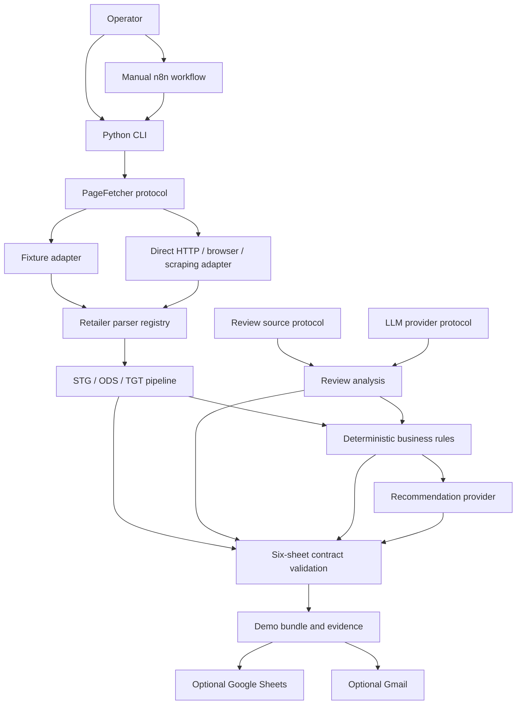
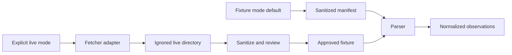
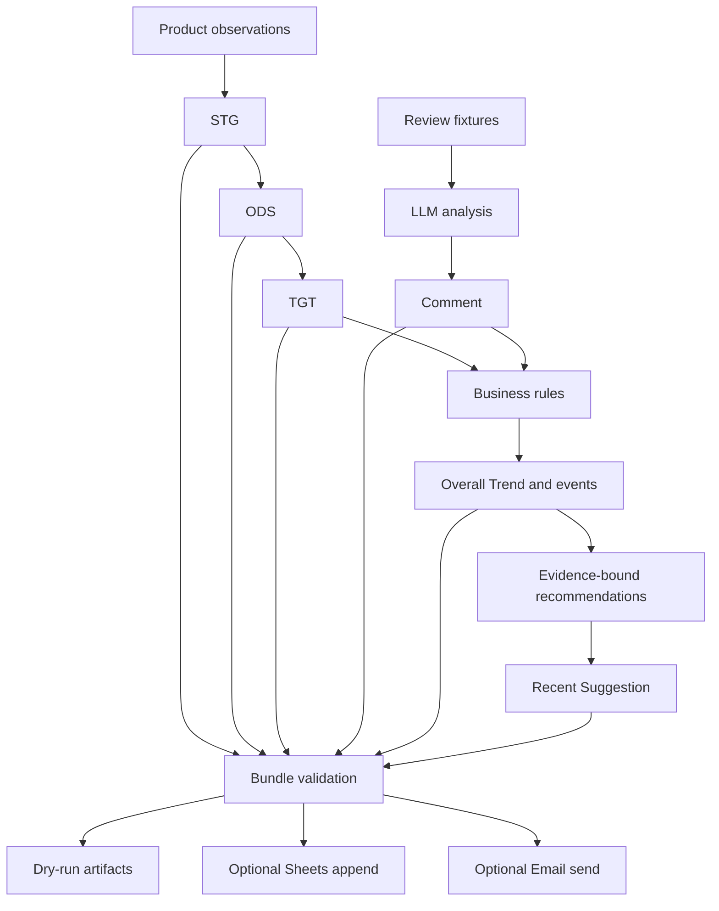

# System Architecture

## Complete architecture

All external calls sit behind a protocol or n8n credential boundary. Business rules and contract
validation remain in Python. The repository contains no credential, recipient, real Sheet ID, or
machine-specific path.

## Fixture and one-time live capture

CI and the public Demo only use the upper fixture path. Live capture is a deliberate, one-time
operator action; its raw output is ignored by Git and cannot silently become a public fixture.

## Processing and delivery flow

## Replaceable boundaries

| Boundary | Offline default | Optional implementation | Core guarantee |
|---|---|---|---|
| Product pages | Fixture fetcher | HTTP, browser, scraping API | Common observation model |
| Reviews | Fixture source | Provider-specific source | Normalized, deduplicated reviews |
| LLM | Deterministic mock | Configured HTTP provider | Structured output validation |
| Sheets | Local JSON/CSV | Google Sheets nodes in n8n | Exact six-sheet contracts |
| Email | HTML/text preview | Gmail node in n8n | Same validated bundle |

There is no scheduler, database, queue, dashboard, or resident API in v1.0.0.
